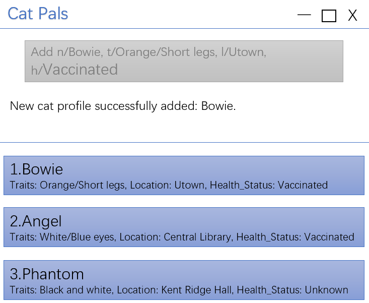

* This is **a sample project for Software Engineering (SE) students**. 
  Example usages:
  * as a starting point of a course project (as opposed to writing everything from scratch)
  * as a case study
* The project simulates an ongoing software project for a desktop application (called _AddressBook_) used for managing contact details.
  * It is **written in OOP fashion**. It provides a **reasonably well-written** code base **bigger** (around 6 KLoC) than what students usually write in beginner-level SE modules, without being overwhelmingly big.
  * It comes with a **reasonable level of user and developer documentation**.
* It is named `AddressBook Level 3` (`AB3` for short) because it was initially created as a part of a series of `AddressBook` projects (`Level 1`, `Level 2`, `Level 3` ...).
* For the detailed documentation of this project, see the **[Address Book Product Website](https://se-education.org/addressbook-level3)**.
* This project is a **part of the se-education.org** initiative. If you would like to contribute code to this project, see [se-education.org](https://se-education.org/#contributing-to-se-edu) for more info.

## Acknowledgements
* This project is based on the AddressBook-Level3 project created by the [SE-EDU initiative](https://se-education.org).
*****

## Security

We propose a feature in our [user stories](https://github.com/orgs/AY2526S2-CS2103T-T16-3/projects/1)
that only **authorized user** can have the access to CatPals. This can be achieved by using
a pair of `UserID` and `UserKey`.
 
*[To be implemented]*

## Background

This project is a **brownfield** software engineering project developed by a team of five,
based on [AddressBook Level 3 (AB3)](https://se-education.org/addressbook-level3/),
a sample desktop application provided by CS2103T course team, AY2526 Sem2.
In the sample project, AB3 simulates an ongoing software project with an existing object-oriented codebase, documentation, and architecture, making it a suitable foundation for extension rather than building a product from scratch.
 
 
Building on this base, our team adapted the original contact-management application into a desktop app for NUS Cate Cafe CCA volunteers to manage information about stray cats on the NUS campus. The app is designed for users who prefer fast keyboard-based interaction, are comfortable with CLI-style workflows, and need an efficient way to identify cats and keep important status details up to date.
 
 
It is intended for personal or small-team volunteer use, rather than as a veterinary medical system, shelter operations tool, or public registry.

## Contributing
This project was developed by a team of five as a brownfield Software Engineering project based on AddressBook Level 3 (AB3).
- [Hongshan](https://github.com/ChenHongshan333)
- [Haofeng](https://github.com/Haofeng125)
- [Jiaqi](https://github.com/lang-jiaqi)
- [Lexi](https://github.com/LexiAKAtiff)
- [Sai](https://github.com/chirlasai)

## License

MIT License

Copyright (c) 2026 AY2526S2 CS2103T-T16-3

Permission is hereby granted, free of charge, to any person obtaining a copy
of this software and associated documentation files (the "Software"), to deal
in the Software without restriction, including without limitation the rights
to use, copy, modify, merge, publish, distribute, sublicense, and/or sell
copies of the Software, and to permit persons to whom the Software is
furnished to do so, subject to the following conditions:

The above copyright notice and this permission notice shall be included in all
copies or substantial portions of the Software.

THE SOFTWARE IS PROVIDED "AS IS", WITHOUT WARRANTY OF ANY KIND, EXPRESS OR
IMPLIED, INCLUDING BUT NOT LIMITED TO THE WARRANTIES OF MERCHANTABILITY,
FITNESS FOR A PARTICULAR PURPOSE AND NONINFRINGEMENT. IN NO EVENT SHALL THE
AUTHORS OR COPYRIGHT HOLDERS BE LIABLE FOR ANY CLAIM, DAMAGES OR OTHER
LIABILITY, WHETHER IN AN ACTION OF CONTRACT, TORT OR OTHERWISE, ARISING FROM,
OUT OF OR IN CONNECTION WITH THE SOFTWARE OR THE USE OR OTHER DEALINGS IN THE
SOFTWARE.
